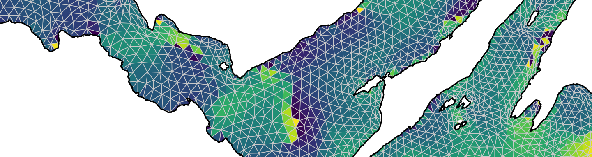

```{r, include = FALSE}
knitr::opts_chunk$set(
  collapse = TRUE,
  comment = "#>",
  fig.path = "man/figures/README-",
  out.width = "100%"
)
```

# fvcom.tbx

[](https://www.repostatus.org/#active)

`fvcom.tbx` is an `R` toolbox for the exploration of unstructured, prism-based hydrodynamic model outputs (i.e. from the Finite Coastal Ocean Volume Model, FVCOM) in `R`. The package has been designed specifically for the West Coast of Scotland Coastal Modelling System (WeStCOMS), which implements FVCOM. Package development has been motivated by the requirements of ecological research, and the need to link hydrodynamic model outputs with ecological analyses implemented in `R`. To this end, the package includes functions which facilitate the following operations: 

* Acquiring FVCOM outputs from the Scottish Association of Marine Sciences (SAMS) thredds server;
* Processing FVCOM outputs for integration with `R`; 
* Computing new hydrodynamic/environmental fields;
* Building unstructured mesh(es) as spatial objects and locating cells and coordinates; 
* Extracting and interpolating model predictions;
* Exploring environmental conditions through space and time with statistical summaries and maps; 
* Validating FVCOM predictions with observations, including from diverse animal movement datasets;

This README file outlines the steps that are required to set up FVCOM outputs for integration with `R` via `fvcom.tbx` and some of the main functionality of the package. For further details, please consult the vignette and the reference manual. 



## Installation

You can install the development version of `fvcom.tbx` from [GitHub](https://github.com) with:

```r
devtools::install_github("edwardlavender/fvcom.tbx", build_vignette = TRUE)
```

If you build the vignette, you can view this with `vignette("fvcom.tbx", package = "fvcom.tbx")`.

## Set up 

Hydrodynamic model outputs are typically stored as MATLAB® or Network Common Data Form (NetCDF) files. Each file contains information on the model structure (e.g., the model mesh) and all of the model predictions for a specific day. Within each file, model predictions are stored as 2- or 3-dimensional arrays. To integrate these files with `R`, via `fvcom.tbx`, follow the workflow detailed below:

1. Acquire FVCOM files. 
2. Define a directory system in which to store environmental arrays extracted from FVCOM files. 
3. Extract and save environmental arrays from FVCOM files into this directory system.  

### Acquire files

The first step is to acquire FVCOM files. FVCOM files can be obtained from source or from a remote server. For file acquisition from a remote server, `fvcom.tbx` includes the `thredds_download()` function which is designed to download WeStCOMS files from the SAMS thredds server. 

From any FVCOM file, it is necessary to obtain the following: 

  * 'mesh.trinodes', a dataframe that defines the nodes surrounding each element. A sample dataframe, `dat_trinodes`, is available in this package.
  * 'nodexy', a dataframe that contains the coordinates (longitude, latitude) for every node. A sample dataframe, `dat_nodexy`, is available in this package.
  * 'FVCOM.h', a dataframe that contains the depth of each node below mean sea level. A sample dataframe, `dat_h` is available in this package. 
  
For each FVCOM file, we also need to extract and save the environmental arrays of interest (see below). 

### Directory conventions 

`fvcom.tbx` is step up to work with environmental arrays rather than the full FVCOM files. Hence, it is necessary to define a set of directories into which, for each FVCOM file, environmental arrays can be extracted and saved. The following directory names are recommended: 
  
  - 'tidal_elevation', to store tidal elevation (m) arrays;
  - 'temp', to store temperature ($^\circ C$) arrays;
  - 'salinity', to store salinity (psu) arrays;
  - 'uwind_speed' and 'vwind_speed', to store the $u$ and $v$ components of wind velocity; 
  - 'ucurrent_speed' and 'vcurrent_speed', to store the $u$ and $v$ components of current velocity; 
  - 'sun_angle', to store sun angle (an optional field which can be computed by `fvcom.tbx`);
  
To create a directory system in which to store outputs, `fvcom.tbx` provides the `create_wcdirs()` function. 

### Environmental array conventions 

With an appropriate directory system in place, the next step is to extract environmental arrays from FVCOM files into this directory system. If you have already obtained the full FVCOM files* (e.g., via `thredds_download()`), this is a possible workflow: 

1. Define a list of FVCOM file names. The function `define_dates2load()` can be used to do this. 
2. Load every file in this list into MATLAB® or another programme to check for any corrupt files: large files are easily corrupted during file transfer or download. The vignette provides an example MATLAB® script to do this. Re-acquire working versions of corrupt files before continuing, if necessary. 
3. Load every FVCOM file into MATLAB® or another programme to extract and save the environmental arrays of interest into an established set of directories (see above). The vignette provides an example MATLAB® script to do this.

*An alternative workflow, rather than obtaining the full FVCOM files and then extracting environmental arrays, is to directly extract and only download specific environmental arrays of interest, which may be faster. `fvcom.tbx` may include functionality via `thredds_url()` and `thredds_extract()` functions to implement this approach in future.

For environmental arrays, `fvcom.tbx` assumes the following conventions:

  - File type. Environmental arrays can be saved in any format (e.g., as .mat files), providing this format can be loaded into `R`. The vignette provides a sample MATLAB® script in which full FVCOM files are loaded into MATLAB®, environmental arrays extracted and then saved into a pre-defined directory system as .mat files. Accordingly, in `fvcom.tbx`, the default function to load files into `R` is `function(con) R.matlab::readMat(con)$data`, but this can be changed by the user as necessary. In any given directory (e.g., '/temp'), all of the environmental arrays should be of the same file type. 
  - File dimension. In any given directory, all arrays should have the same dimension. 
  - File name. In each directory, each file is named by a 6 digit code (hereafter termed the 'date_name') which provides a unique identifier of the date to which that file pertains in the format YYMMDD. The function `date_name()` is used to flick between dates and WeStCOMS file names. 

Armed with the necessary standard FVCOM objects and environmental arrays, we can now proceed to implement functions in `fvcom.tbx` to build model mesh(es), compute new fields, extract model predictions, explore environmental conditions and validate model predictions with observations. 

## Build unstructured mesh(es)

Several functions are designed to facilitate building and working with unstructured meshes. These include: 

* `build_mesh()` - build an unstructured mesh (around nodes or elements) from node coordinates and connections as a `SpatialPolygonsDataFrame`;
* `find_cells()` - find the mesh cells (for nodes or elements) which enclose inputted coordinates;
* `find_xy()` - find the coordinates of mesh cells (for nodes or elements);

## Compute new fields

The `compute_field_from_fvcom()` is designed for the flexible computation of new fields using existing hydrodynamic model outputs. This is supported by helper functions for commonly desirable fields such as:

* `calc_thermocline()` - calculate thermocline strength from temperature predictions;
* `calc_direction()` - calculate wind/current direction from $u$ and $v$ component vectors; 
* `calc_speed()` - calculate wind/current speed from $u$ and $v$ component vectors;

There are also some functions for the computation of specific new fields from scratch (such as sun angle) in cases where it is helpful to express variables which are not resolved by the hydrodynamic model across the same mesh (for instance, to investigate the extent of spatiotemporal variation over the same spatial domain). These include the following:

* `compute_sun_angle()` - compute sun angle as a new field;
* `compute_field_photoperiod()` - compute photoperiod as a new field;

## Extract model predictions 

Some functions are designed to facilitate the extraction of model predictions from source files. These include the following: 

* `exclude_corrupt()` and `exclude_unavailable()` - exclude corrupt and unavailable files from file names vector;
* `expand_by_hour()` - expand a dataframe with times at non-integer hours to include surrounding integer hours for extraction;
* `extract()` - extract model predictions for multiple dates/hours/layers/mesh cells;
* `depth_from_known()` - calculate the depth of Sigma layers using known parameters;
* `depth_from_unknown()` - compute the depth of Sigma layers using unknown (i.e., extracted) parameters and/or assign the depths of Sigma layers to a dataframe using nearest neighbour or bilinear interpolation; 
* `shrink_by_hour`, `interp_btw_hours()`, `interp_btw_depths()` and `interp_layer()` - interpolate predictions between hours or layers and  fractional layer numbers; 

## Explore environmental conditions

Some functions are designed to facilitate exploration of environmental conditions through space and/or time. These include the following: 

* `summarise_field_2d()` - compute statistical summaries of environmental conditions across a Sigma layer (through time for a given file, if applicable); 
* `plot_field_2d()` - visualise environmental conditions across a Sigma layer through space at a specified point in time; 
* `explore_field_2d()` - implement `summarise_field_2d()` and `plot_field_2d()` across multiple timepoints and/or model files; 
* Additional plotting functions are available in the [`prettyGraphics`](https://github.com/edwardlavender/prettyGraphics) package, including `pretty_scape_3d()` and `vis_scape_3d()` which produce interactive, 3-dimensional visualisations of landscapes/seascapes and/or environmental conditions; for large rasters, `crop_aggr_utm()` helps reduce raster dimensions for these functions;

## Validate model predictions 

`validate()` facilitates the comparison of observed conditions (including those from animal movement datasets) with predicted conditions to evaluate model skill. 

## Future functionality 

Future developments to `fvcom.tbx` may include developing the following functionality: 

* Relaxing file naming conventions; 
* Acquiring specific environmental fields from thredds' servers; 
* Exploring temperature profiles through space and time;
* Exploring spatiotemporal variation in environmental conditions in 3-dimensions;
* Estimating bottom velocity from vertical profiles;

## Disclaimer

`fvcom.tbx` is a new package at an early stage of evolution. Please report issues, comments or suggestions! 

## Links

WeStCOMS was developed at the [Scottish Association for Marine Sciences](https://www.sams.ac.uk/) by [Dmitry Aleynik](https://www.sams.ac.uk/people/researchers/aleynik-dr-dmitry/). 
