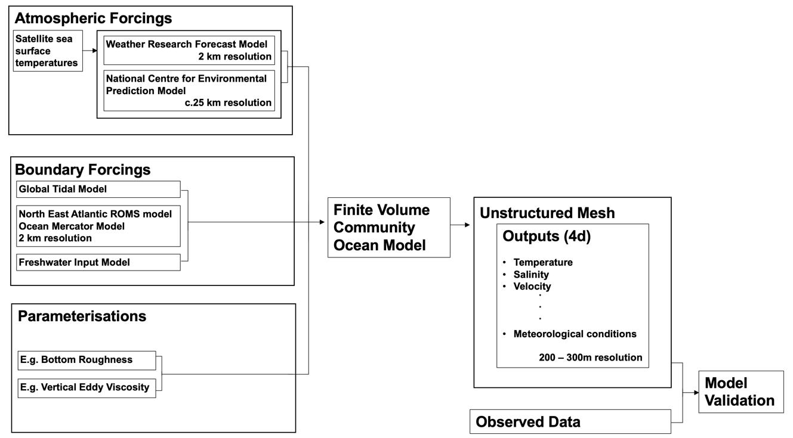

<style>
body{
  width: 100%;
  height: 100%;
  font-family: TimesNewRoman;
  font-size: 12pt;
  text-align: justify;
  }
  p{
  margin-bottom: 1.2em;
  }
</style>

```{r, include = FALSE}
knitr::opts_chunk$set(
  collapse = TRUE,
  comment = "#>"
)
```

# Abstract

High resolution hydrodynamic models create unprecedented opportunities to understand the variation in environmental conditions in an area though time. For example, the West Scotland Coastal Ocean Modelling System (WeStCOMS) resolves environmental conditions in 3 dimensions, at resolutions of 10s to 100s of metres in the vertical and horizontal dimensions respectively, at hourly intervals. These models provide ecological researchers working in these environments with invaluable contextual information. However, the complexity of hydrodynamic models, together with the lack of simple, open source, exploratory software -- written in a variety of widely used languages -- can make utilising their outputs a steep learning curve for researchers in other disciplines and hamper their application. To this end, I outline an `R` package designed to facilitate the exploration of outputs from the Finite Volume Community Ocean Model (FVCOM), which is implemented by WeStCOMS. This provides a gateway for the growing numbers of researchers learning and using `R` into the use of FVCOM predictions in their research. 

# Introduction

Hydrodynamic models are mathematical models which, given a set of inputs, predict hydrodynamic conditions across an area based on our knowledge of physical, oceanographic processes [@Kmpf:2009:OMB:1823110]. For researchers working in environments for which hydrodynamic models are available, these may provide a wealth of information because they move beyond the point data typically collected in a small number of locations in the study area to predictions of environmental conditions across the whole study area at high resolution in space and time. This level of information opens the door to new research opportunities in other disciplines, such as ecology. For example, in the field of animal movement, comparing the distribution of environmental conditions experienced by tagged individuals in relation to geographic variation in environmental conditions can help identify putative movement pathways and possible habitat preferences [@braun2018].

However, understanding and using the outputs of hydrodynamic models is a steep learning curve for many researchers with backgrounds in other disciplines. In particular, one limiting factor is programming language: whilst MATLAB® is the preferred coding language for many oceanographers, a large portion of ecologists are much more familiar with `R` [@r2018]. Indeed, a recent study of 60,000 peer-reviewed articles in ecology found that that 58 % reported `R` to be their primary tool for data analysis [@doi:10.1002/ecs2.2567]. In this context, creating the capacity for researchers with experience in a variety of different programming environments, especially those that are open source, such as `R`, is likely to facilitate the integration of hydrodynamic modelling and ecology. 

The West Scotland Coastal Ocean Modelling System (WeStCOMS) is a numerical, hydrostatic, hydrodynamic modelling system which can be used to resolve environmental conditions off the West Coast of Scotland [@aleynik2016]. WeStCOMS was developed at the Scottish Association for Marine Science by Dmitry Aleynik (https://www.sams.ac.uk/people/researchers/aleynik-dr-dmitry/). At the core of WeStCOMS is a finite volume community ocean model (FVCOM) module [@chen2003]. This module is forced with local atmospheric and boundary forcings, and incorporates several parameterisations (e.g. bottom roughness), tailored to the West Coast of Scotland, to estimate environmental conditions (e.g. temperature, salinity, current velocity; see Figure below). Environmental conditions are resolved across an unstructured mesh based on a system of (non-overlapping) prisms of variable size, organised into 11 vertical (Sigma) layers (layer 1 is at the surface; layer 11 is below the seabed). The unstructured mesh improves computational efficiency because resolution can be maximised in hydrodynamically complex areas and minimised elsewhere: horizontally, resolution is highest near the coast (c. 130 m resolution); vertically, resolution is highest near the surface and the seabed. Sam Jones (https://www.sams.ac.uk/people/researchers/jones-dr-sam/) provides some beautiful visualisations of the 3 dimensional mesh structure (e.g. https://www.youtube.com/watch?v=3KP4Fo2FaNk). 

Some model outputs (namely, scalar fields, e.g., temperature) are resolved at the vertices (termed 'nodes') of each prism, whereas other model outputs (namely vector fields, e.g., velocity) are resolved in the centroids (termed 'elements') of each prism. This means that there are, in effect, two grids over which environmental conditions are resolved: one linking nodes (surrounding elements) and one linking elements (surrounding nodes). This structure has particularly important implications for researchers studying benthic or demersal organisms: while the deepest model outputs for 3-dimensional scalar fields (e.g. temperature), which are resolved at prism vertices, are by the seabed, the deepest values for 3-dimensional vector fields (i.e., velocity) are resolved at the centroids of the last layer, not the vertices, which may be above the sea bottom (perhaps c. 5 - 15 m, depending on the depth). Resolving bottom velocities is an ongoing research area but their extrapolation from vertical profiles derived from WeStCOMS is one possible method. Surface conditions (e.g. sea surface temperature) are reasonably well validated for WeStCOMS, but validation of bottom conditions is more challenging [@aleynik2016].

FVCOM modules form the heart of many hydrodynamic models like WeStCOMS. Within model domains, hydrodynamic predictions provide a valuable resource to scientists conducting research in these environments. To this end, `fvcom.tbx` is an `R` package designed to facilitate the integration of the FVCOM outputs, especially those by WeStCOMS, with ecological research occurring in the same environment for researchers that are primarily familiar with `R` as their preferred programming language. This vignette outlines the use of some of these functions to explore the conditions off the West Coast of Scotland. 

```{r, echo = FALSE, fig.cap = "A simplified representation of the WeStCOMS modelling framework.", out.width = '100%'}

```
 
# Set up 

## Install and load `fvcom.tbx`

Let's begin by installing and loading the `fvcom.tbx` package: 

```{r}
## Install development version of package
# devtools::install_github("https://github.com/edwardlavender/fvcom.tbx/")

## Load package
library(raster)
library(fvcom.tbx)

## View functions
# help(package = "fvcom.tbx")
```

## FVCOM files

WeStCOMS outputs are generally stored as MATLAB® (.mat) or NetCDF (.nc) files. The outputs for each day are defined in  separate files. File names contain a 6 digit code which defines the date for which that file contains outputs, in the format YYMMDD. For example, a file containing the information from $1^{st}$ September 2016 would contain the code 160901. Each file contains a variety of objects, including a 'mesh' object, which defines the structure of the mesh, and an 'FVCOM1' object, which includes predicted environmental conditions. Environmental conditions are stored in 2- or 3-dimensional arrays, with predictions for each hour in each mesh cell or for each hour, layer and mesh cell (see below). 

## File acquisition

To use FVCOM outputs in `R`, the first step is to acquire FVCOM files. FVCOM files can be obtained from source or from a remote server. For file acquisition from a remote server, `fvcom.tbx` includes the `thredds_download()` function which is designed to download WeStCOMS files from the SAMS thredds server.

From any FVCOM file, the following outputs are required for many `fvcom.tbx` functions and can be obtained:

1. A dataframe that defines the nodes surrounding each element (i.e. which nodes are connected to which other nodes). For MATLAB® files, this is defined in the 'mesh.trinodes' object. A example dataframe, `dat_trinodes`, is available in this package.
2. A dataframe that contains the coordinates (longitude, latitude) for every node. For MATLAB® files, this is defined in the 'mesh.nodexy' object. A example dataframe `dat_nodexy` is available in this package. 
3. A dataframe that contains the depth of each node below mean sea level. For MATLAB® files, this is defined in the 'FVCOM1.h' object (the depth below mean sea level is constant irrespective of date). A example dataframe, `dat_h`, is available in this package. 

For each FVCOM file, we also need to extract and save the environmental arrays of interest prior to implementing `fvcom.tbx` functions (see below). 

## Directory conventions  

The size of FVCOM files makes reading them in and out of programmes challenging. For this reason, `fvcom.tbx` is designed to work with environmental arrays rather than the full FVCOM files. Specifically, many functions read in/out environmental arrays to create new environmental fields or to extract/explore environmental conditions. Hence, it is necessary to define a set of directories into which, for each FVCOM file, environmental arrays can be extracted and saved. The following directory names are recommended: 
  
  - 'tidal_elevation', to store tidal elevation (m) arrays;
  - 'uwind_speed' and 'vwind_speed', to store the $u$ and $v$ components of wind velocity ($ms^{-1}$); 
  - 'wind_speed', to store wind speeds ($ms^{-1}$) (an optional field which can be computed by `fvcom.tbx` from $u$ and $v$ component vectors); 
  - 'wind_direction', to store wind direction ($^\circ$) (an optional field which can be computed by `fvcom.tbx` from $u$ and $v$ component vectors);
  - 'temp', to store temperature ($^\circ C$) arrays;
  - 'thermocline_strength', to store thermocline strength ($^\circ C$) (an optional field which can be computed by `fvcom.tbx` from temperature fields);
  - 'salinity', to store salinity (psu) arrays;
  - 'uvelocity' and 'vvelocity', to store the $u$ and $v$ components of current velocity ($ms^{-1}$); 
  - 'current_speed', to store current speed ($ms^{-1}$) (an optional field which can be computed by `fvcom.tbx` from $u$ and $v$ component vectors);
  - 'current_direction', to store current direction ($^\circ$) (an optional field which can be computed by `fvcom.tbx` from $u$ and $v$ component vectors); 
  - 'sun_angle', to store sun angle (an optional field which can be computed by `fvcom.tbx`);
  
To create an appropriate directory system in which to store outputs, `fvcom.tbx` provides the `create_wcdirs()` function:
```{r, warning = FALSE}
# Define directory in which to store folders with environmental arrays:
WeStCOMSpath <- system.file("WeStCOMS_files", package = "fvcom.tbx", mustWork = TRUE)
WeStCOMSpath <- paste0(WeStCOMSpath, "/")
# These folders are already present with example datasets:
list.files(WeStCOMSpath)

# Define a vector of other environmental variables for which to create folders; e.g.: 
vars <- c("salinity", "uvelocity", "vvelocity")

# Create additional folders:
fvcom.tbx::create_wcdirs(dir = WeStCOMSpath, 
                         vars = vars
                         )
# Check that we have successfully created new folders in the specified path for each variable:
vars %in% list.files(WeStCOMSpath)
```

## Environmental array conventions

With an appropriate directory system in place, the next step is to pull the environmental arrays from FVCOM files into this directory system. If you have already obtained the full FVCOM files (e.g., via `thredds_download()`), you probably want to define a list of file names and then use this to load the FVCOM files into MATLAB® or another programme to check for corrupt files and then to extract environmental outputs. Another option is to bypass the acquisition of full FVCOM files and obtain the environmental arrays of interest directly (see below). 

### Define a list of FVCOM file names  

If you have already obtained the full FVCOM files (e.g., via `thredds_download()`), the first step is to define a dataframe, comprising a sequence of dates for which you have FVCOM files, that can be imported into MATLAB® or another programme to check that files are not corrupt. To this end, the `fvcom.tbx::define_dates2load()` function can be used to define a sequence of FVCOM file names that correspond to particular dates. In this function, you can either specify a start date and and end date, if you have access to FVCOM outputs for each date between these dates, or a custom vector of dates otherwise. The function returns a dataframe comprising `date` (a Date object), `year` (a 2-digit numeric object) and `date_name` (a 6 digit numeric object which reflects the WeStCOMS file name code corresponding to each date). Here, let's assume we have access to all the FVCOM files between 2016-03-01 and 2016-03-05: 
```{r}
# Use define_dates2load() function to define an initial series of dates to check whether all WeStCOMS outputs are functional 
dates2load <- fvcom.tbx::define_dates2load(start_date = as.Date("2016-03-01"), 
                                                  end_date = as.Date("2016-03-05"), 
                                                  corrupt_dates = NULL)

# View dates: 
dates2load 

# This dataframe should now be saved as a .csv file that can be imported into Appendix Script A or another script. 
```

Under the hood, this function uses `fvcom.tbx::date_name()` function to convert dates to date names that match WeStCOMS files. For example: 
```{r}
fvcom.tbx::date_name(x = as.Date("2016-03-01"), define = "date_name")
```
It is also useful be able to reverse the process:
```{r}
fvcom.tbx::date_name(x = 160301, define = "date")
```

### Check for corrupt files 

This list of FVCOM files can be used to load FVCOM files into MATLAB® or another programme to identify any corrupt files. Appendix A script provides a simplified example. If there are any FVCOM files which fail to load, we can re-acquire these before proceeding or simply exclude them from the sequence of FVCOM files that we choose to work with: 
```{r}
# Define a dataframe for Appendix Script B that excludes any corrupt dates: 
dates2load <- fvcom.tbx::define_dates2load(start_date = as.Date("2016-03-01"), 
                                                  end_date = as.Date("2016-03-05"), 
                                                  corrupt_dates = as.Date("2016-03-02"))

# View dates: 
dates2load 

# Save dataframe.
```

### Extract and save environmental arrays

Now that we have a list of working FVCOM files, we can load this list into MATLAB® or another programme and export environmental arrays to our directory system. Appendix Script B provides a simple MATLAB® script for this task. This script loads the WeStCOMS file for each specified day into MATLAB® and, for each environmental variable of interest, saves another MATLAB® file which contains only the information associated with that variable. Another route to this point is to use some custom code to extract and save the environmental arrays within each FVCOM file directly, but `fvcom.tbx` does not currently provide functions for direct array acquisition in this way. 

For environmental arrays, `fvcom.tbx` assumes the following conventions: 

* **File type**. Environmental arrays can be saved in any format (e.g., as .mat files), providing this format can be loaded into `R`. In the example MATLAB® script, environmental arrays are saved as .mat files (which occupy less space than, perhaps, more familiar (e.g. .csv) file structures). Accordingly, in `fvcom.tbx`, the default function to load files into `R` is `function(con) R.matlab::readMat(con)$data`, but this can be changed by the user as necessary. In any given directory (e.g., '/temp'), all of the environmental arrays should be of the same file type.
* **File dimension**. In any given directory, all files should have the same dimension. For 3-dimensional variables (e.g. temperature), environmental arrays have the structure hours x layers x cells; i.e., cell 1 x 10 x 2 is the temperature for the first hour (00:00) of that day, at layer 10, at node 2. For 2-dimensional fields, environmental arrays have the structure hours x cells.  
* **File name**. The name of each file should be the `date_name` code corresponding to that date (plus some extension). 

 **_The functions in this package generally assume that FVCOM outputs have been saved in this way (i.e., for each environmental variable, there is a folder containing files, whose names are the date names corresponding to a particular date, and each file is an array, usually with a .mat, .nc or .rds extension)_**. 

This complexity is necessary because the outputs of hydrodynamic models like WeStCOMS are so large. Typically, this means that predictions have to be partitioned into different samples (e.g. outputs for each day) which can be read in and out of `R` one (or at most a few) file(s) at a time. Extracting only the environmental arrays from each WeStCOMS file reduces the storage space required to store model outputs and makes reading files into `R` much quicker.

# Build unstructured mesh(es)

## Use `build_mesh()`

Building the unstructured mesh is one of the first tasks a user exploring the outputs of WeStCOMS is likely to want to achieve. This can be accomplished using the `build_mesh()` function, which requires two dataframe inputs: `nodexy`, a dataframe containing the coordinates (longitude, latitude) of each node; and `trinodes`, a dataframe defining the three nodes surrounding each element. In WeStCOMS, there are effectively two types of mesh: one that links elements and surrounds nodes (`mesh_type = "element"`), and one that links nodes and surrounds elements (`mesh_type = "node"`). If you want to plot environmental conditions across space (without interpolation), then the first mesh type is appropriate for plotting environmental conditions resolved at nodes, because at the heart of each cell is a node; whereas the second mesh type is appropriate for plotting environmental conditions resolved at elements, because at the heart of each cell is an element. The process of building complex meshes may take a few minutes, but a cluster object can be supplied to the `cl` argument to speed up the process. The function only needs to be run once; then the result can be saved as a shapefile which can be loaded into other scripts. 

This package includes a sample of information required to build the mesh in a small area around Oban. The full datasets are available from WeStCOMS outputs. Before we build the mesh, let's examine these example dataframes:
```{r}
# Examine dat_trinodes
str(fvcom.tbx::dat_trinodes)
head(fvcom.tbx::dat_trinodes, 3)

# Examine dat_nodexy
str(fvcom.tbx::dat_nodexy)
head(fvcom.tbx::dat_nodexy, 3)
```

Using these objects, we can build the unstructured mesh: 
```{r}
# Define coordinate system (WGS84)
proj <- sp::CRS("+init=epsg:4326")

# Note that with the full mesh, you might choose to run the build_mesh() algorithm in parallel. 
# This code below demonstrates how to do this; however, because we are only working with a 
# ... subset of the mesh here, this is not necessary, so we will set cl to NULL (the default):
cl <- NULL
# If you want to define a cluster to run build_mesh algorithm in parallel (for speed): :
# cl <- parallel::makeCluster(12L)

# Use build_mesh() to define a mesh based on elements (i.e. around nodes):
# This returns a SpatialPolygonsDataFrame. 
# The user is recommended to build the whole mesh and crop this to 
# ... their study domain, rather than using a subset of nodexy/trinodes to construct 
# ... the mesh (even though this can be quicker). 
dat_mesh_around_nodes <- fvcom.tbx::build_mesh(nodexy = dat_nodexy, 
                                                  trinodes = dat_trinodes,
                                                  mesh_type = "element", 
                                                  proj4string = proj, 
                                                  cl = cl, 
                                                  pass2varlist = list("dat_trinodes", "dat_nodexy", "proj")
                                                  )

```

## Visualise unstructured mesh(es)

You can plot the mesh using functions in the `raster` package. First, let's define the boundaries of the study area:
```{r}
# Define boundaries of the study area; we'll define a small area of interest around Oban: 
# A list is included in the package which includes the coordinates of this sample area:
xlim1 <- fvcom.tbx::dat_area_boundaries$xlim1
xlim2 <- fvcom.tbx::dat_area_boundaries$xlim2
ylim1 <- fvcom.tbx::dat_area_boundaries$ylim1
ylim2 <- fvcom.tbx::dat_area_boundaries$ylim2

# Define as an extent object that we'll use to crop spatial data to the study site: 
extent_study_site <- raster::extent(xlim1, xlim2, ylim1, ylim2)

# Crop mesh to be within the study area (for neatness on plot):
dat_mesh_around_nodes <- raster::crop(dat_mesh_around_nodes, extent_study_site)
```

For mapping, it is useful to have a background coastline map. Some open source data defining the coastline (technically, the administrative area defined by the UK), cropped to the limits of the study area, is included in the package as `dat_coast_around_oban`. The data come from GADM (https://www.gadm.org/index.html). Using these data, we can now proceed to plot the study area and overlay the mesh: 
```{r, fig.cap = "A sample of the WeStCOMS mesh around nodes.", fig.height = 8, fig.width = 8}
# Plot the study area
raster::plot(dat_coast_around_oban, 
             xlim = c(xlim1, xlim2), 
             ylim = c(ylim1, ylim2))

# Add the mesh as lines: 
raster::lines(dat_mesh_around_nodes)

# You can adjust this plot as you wish. 
```

In the same way, we can build and plot the mesh around elements. This should be slightly quicker. Note that, normally, you will receive a warning when you build the mesh based on nodes for every mesh element (i.e. prism): "In sp::Polygon(coords, hole) : less than 4 coordinates in polygon". This warning is flagging up that our mesh is based on triangles, which are defined by three coordinates, and can be safely ignored. For this vignette, I've hidden the warning. 
```{r, warning = FALSE, fig.cap = "A sample of the WeStCOMS mesh around elements.", fig.height = 8, fig.width = 8}
# Use build_mesh to define a mesh around elements (i.e. based on nodes): 
dat_mesh_around_elements <- fvcom.tbx::build_mesh(nodexy = dat_nodexy, 
                                                  trinodes = dat_trinodes,
                                                  mesh_type = "node",
                                                  proj4string = proj, 
                                                  cl = cl,
                                                  pass2varlist = list("dat_nodexy", "dat_trinodes", "proj")
                                                  )

# Crop mesh to study area: 
dat_mesh_around_elements <- raster::crop(dat_mesh_around_elements, extent_study_site)
# Plot map and mesh:
raster::plot(dat_coast_around_oban, 
             xlim = c(xlim1, xlim2), 
             ylim = c(ylim1, ylim2))
raster::lines(dat_mesh_around_elements)
```

## Identify specific mesh cells 

It is often useful to identify the mesh cells which correspond to particular coordinates or vice versa. To find the mesh cells which enclose inputted coordinates, we can use the `find_cells()` function: 

```{r}
# Ensure that mesh has the correct projection 
proj <- sp::CRS("+proj=longlat +datum=WGS84 +no_defs +ellps=WGS84 +towgs84=0,0,0")
raster::crs(dat_mesh_around_nodes) <- proj
# Define a dataframe with mesh IDs corresponding to particular coordinates: 
cells <- 
  find_cells(
      # supply lat and long coordinates (a dataframe or SpatialPoints object can also be supplied)
      lat = c(56.45677, 56.39577, 56.47952), 
      long = c(-5.403469, -5.514656, -5.469907),
      # Convert mesh IDs from factors to integers
      f = function(x) as.integer(as.character(x)),
      # Supply mesh
      mesh = dat_mesh_around_nodes,
      # Return a dataframe with one row for each inputted coordinate pair
      return = 1
  )
cells
```

## Identify mesh cell coordinates 

Likewise, we can use `find_xy()` to find the coordinates of specific mesh cells from a mesh or `nodexy` object:

```{r}
find_xy(mesh_ID = cells$mesh_ID, mesh = dat_mesh_around_nodes)
find_xy(mesh_ID = cells$mesh_ID, nodexy = dat_nodexy)
```

Note that the latter method is more accurate and faster, but only implemented for nodes. For elements, the extraction of coordinates from the mesh is the only method currently implemented.

# Compute new fields 

You may wish to define other environmental variables of interest across this mesh. For example, you may wish to simplify the $u$ and $v$ components of wind velocity into wind speed; or you may wish to use the 3-dimensional temperature outputs to define a 2-dimensional representation of thermocline parameters (e.g. thermocline strength) so that you can examine how these parameters change over space. To do this, the `fvcom.tbx::compute_field_from_fvcom()` function can be used. You might also want to calculate other variables of ecological relevance, such as sun angle, which are not resolved by FVCOM but quickly calculated in `R`, so that spatiotemporal variation in all environmental variables of interest can be expressed over the same area in the same way.

Prior to the computation of new fields, we need to add the necessary folders to a directory for storing new outputs: 
```{r, warning = FALSE}
# Define a vector of variables to derive from FVCOM outputs.
new_vars <- c("wind_speed", 
              "wind_direction",
              "sun_angle")

# Define a new folder for each of these variables: 
fvcom.tbx::create_wcdirs(dir = WeStCOMSpath, 
                         vars = new_vars)

# Check
new_vars %in% list.files(WeStCOMSpath)
```

## Compute fields from FVCOM outputs 

The `compute_field_from_fvcom()` function is designed to create new fields from existing outputs. To do this, you need to specify a list of the environmental arrays from which new fields can be computed. These files are loaded sequentially or in parallel into `R` and for each array (or combination of arrays), a user-supplied function is applied to compute a new field. For the computation of commonly desired fields, a few helper functions are provided: 

1. `calc_thermocline_strength()` ($^\circ C$). This function is used to calculate thermocline strength. For each day, for each hour and in each node, the strength of the thermocline is calculated as the difference between the temperature resolved at the shallowest and deepest Sigma layers. This metric is used instead of other metrics (e.g. the standard deviation of a temperature profile, which has been show to be reasonable metric of thermocline strength [@fiedler2010]), because a difference is so much quicker to calculate. Note that `thermocline_strength()` cannot be calculated with the example predictions included in this package, which only contain temperature outputs for the $1^{st}$ and $2^{nd}$ layers (to minimise package size).
2. `calc_speed()` ($ms^{-1}$). This function is used to calculate wind or current speed from the $u$ and $v$ components of wind or current velocity. 
3. `calc_direction()` ($^\circ$). This function is used to calculate wind or current direction. Direction is expressed as the cardinal direction of mass flow (i.e. the direction in (not from) which the force is blowing). 

For each date specified, for each environmental variable, the function will save a new .rds file in the appropriate folder in the supplied directory. (.rds files are the like the `R` equivalent of .mat files; they are used by fvcom.tbx to maximise storage space efficiency and ensure file consistency.) For larger sequences of dates, this function can be implemented in parallel, but this is not necessary here.

Here is an example of the use of `compute_field_from_fvcom()` to generate arrays for wind speed: 

```{r}
## Step A: Define a list of source files, with one element comprising all the files required for each day: 
# Define the path to the u and v files:
path_u <- paste0(WeStCOMSpath, "uwind_speed")
path_v <- paste0(WeStCOMSpath, "vwind_speed")
# Define the source files:
source_u <- list.files(path_u, full.names = TRUE)
sourve_v <- list.files(path_v, full.names = TRUE)
# Define a list comprising u and v files with one element for each day:
source_file   <- mapply(c, source_u, sourve_v, SIMPLIFY = FALSE)
# Examine the list of source files
source_file

## Step B: Define a list of file names for saved files and the directory in which to save files:
# Define date names for relevant files
sink_file <- substr(list.files(path_u), 1, 6)
# Define directory to save outputs
sink_dir <- paste0(WeStCOMSpath, "wind_speed/")

## Step C: Compute and save wind speeds using calc_speed() helper function: 
wind_speed_ls <-
  compute_field_from_fvcom(source_file = source_file,
                           sink_file = sink_file,
                           read_fvcom = function(con) R.matlab::readMat(con)$data,
                           calc = calc_speed, 
                           dir2save = sink_dir, 
                           cl = NULL, 
                           verbose = TRUE
  )

## Step D: List files in folder:
list.files(sink_dir)
```

In the same way, we could compute wind direction; `compute_field_from_fvcom()` does the work loading, processing and saving files and we simply pass the `calc_direction()` helper function to compute wind direction at the appropriate point in this process: 

```{r}
wind_speed_ls <-
  compute_field_from_fvcom(source_file = source_file,
                           sink_file = sink_file,
                           read_fvcom = function(con) R.matlab::readMat(con)$data,
                           calc = calc_direction, 
                           dir2save = paste0(WeStCOMSpath, "wind_direction/"), 
                           cl = NULL, 
                           verbose = TRUE
  )
list.files(paste0(WeStCOMSpath, "wind_direction/"))
```

## Compute other fields

It may be useful to compute other environmental fields across the WeStCOMS mesh. For this, more specialised functions are required. To this end, `fvcom.tbx` includes the `compute_field_sun_angle()` and `compute_field_photoperiod()` functions to compute sun angles and photoperiod respectively. Here is an example of the computation of sun angle: 

```{r, message = FALSE}
compute_field_sun_angle(
   nodexy = dat_nodexy,
   date = as.Date(c("2016-03-01", "2016-03-02")),
   tz = "UTC",
   hours = 0:23,
   units = "degrees",
   dir2save = paste0(WeStCOMSpath, "sun_angle/"),
   verbose = TRUE
   )
list.files(paste0(WeStCOMSpath, "sun_angle/"))
```

# Example model outputs 

We are now in a position to start using model predictions. For each variable, environmental conditions are stored in a 2- or 3-dimensional arrays. In this package, I have included two example .mat files for each of the following variables:

* wind speed (u component);
* wind speed (v component);
* tidal elevation;
* temperature;

To reduce package volume, I have only included two hours (0, 1), two layers (1,  2, if applicable) and the subset of nodes/elements enclosed in the area defined around Oban above. For the 2-dimensional or 3-dimensional variables, this means that columns or sheets $1, 2,...n$, do not correspond to nodes/elements $1, 2,...,n$, but to nodes `dat_mesh_around_nodes$ID[1:n]` or elements `dat_mesh_around_elements$ID[1:n]`. For example, the first three columns/sheets correspond to nodes `r dat_mesh_around_nodes$ID[1:3]`, for variables resolved at nodes, or elements `r dat_mesh_around_elements$ID[1:3]`, for variables resolved at elements. Otherwise, these outputs are identical to the outputs extracted from WeStCOMS. 

# Extract model predictions

Often, users of hydrodynamic models have a series of observations in time and space to which they want to add environmental variables (e.g., as covariates of a response in some statistical model or to validate hydrodynamic model predictions with observations). Since WeStCOMS files are stored in separate files, extracting the predictions for multiple days can be slow and cumbersome. `extract()` automates this process. To use this function, we need to define a dataframe which specifies the days, times and locations for which we want model predictions and the path to the files; `extract()` then takes care of the rest. 

Consider the following example in which we have a dataframe comprising timestamps, locations (in 2-dimensional in this example) and other environmental attributes: 

```{r, include = FALSE}
#### Define an example animal movement or sampling dataset
# ... ensuring that example coordinates are in the domain for
# ... which there are example predictions:
set.seed(1)
dat_nodexy$xy <- paste0(dat_nodexy$x, "_", dat_nodexy$y)
dat_move <- data.frame(timestamp = as.POSIXct("2016-03-01"),
                       xy = sample(x = dat_nodexy$xy, size = 10))
dat_move$long <- as.numeric(stringr::str_split_fixed(dat_move$xy, "_", n = 2)[, 1])
dat_move$lat <- as.numeric(stringr::str_split_fixed(dat_move$xy, "_", n = 2)[, 2])
dat_move$xy <- NULL
```

```{r}
utils::str(dat_move)
```

Let's imagine that this represents the movement of a surface-dwelling animal across an area. We want to understand whether the animal's movement is related to temperature; we do not have any temperature observations, but we can extract them from WeStCOMS. First, we need to define the appropriate columns in our dataframe so that `extract()` can pull out the desired predictions: 

```{r}
# extract() requires a dataframe with date names, hours, layers (if applicable) and mesh IDs
dat_move$date_name <- date_name(dat_move$timestamp)
dat_move$hour      <- lubridate::hour(round.POSIXt(dat_move$timestamp, units = "hours"))
dat_move$layer     <- 1
dat_move$mesh_ID   <- find_cells(long = dat_move$long,
                                 lat = dat_move$lat,
                                 mesh = dat_mesh_around_nodes,
                                 f = function(x) as.numeric(as.character(x)),
                                 return = 4)
utils::str(dat_move)
```

Next, we need to define ensure that `extract()` understands the relationship between rows and columns in each array and the corresponding hours and mesh nodes. We also need to specify where `extract()` can find the files:

```{r}
# Define match dataframes to provide the link between dat_move and WeStCOMS arrays:
match_hour <- data.frame(hour = 0:1, index = 1:2)
match_mesh <- data.frame(mesh = dat_nodexy$node_id, index = 1:length(dat_nodexy$node_id))
# Define path from which to load files 
path <- system.file("WeStCOMS_files/temp",
                    package = "fvcom.tbx", mustWork = TRUE)
path <- paste0(path, "/")
```

Now, we can implement `extract()` to add temperature predictions to our dataframe. Since we are working with only one file, we will implement the algorithm in sequence but, for more files, we probably want to implement the algorithm in parallel. 

```{r}
dat_move <- 
  extract(dat = dat_move,
          match_hour = match_hour,
          match_mesh = match_mesh, 
          dir2load = path, 
          extension = ".mat", 
          verbose = TRUE)
```

We could now proceed to investigate whether animal movement is related to environmental temperature. If we have observations in three dimensions, we would also need to specify the layer from which to extract predictions (see the `depth_from_known()` and `depth_from_unknown()` functions), but the example outputs in the package only include the first two Sigma layers. For non-integer observations, we could either extract the predictions for the nearest hours/layers/mesh cells (i.e., nearest neighbour interpolation) or extract predictions for surrounding multiple hours/layers/mesh cells and interpolate between them (see the `interp_*()` functions). Alternatively, we could compute the exact solution using the Finite Volume method, but this approach is not currently implemented in `fvcom.tbx`.  

# Explore 2-dimensional environmental fields 

More broadly, it is often instructive to examine the overall variation in environmental conditions over time or space. For 2-dimensional environmental fields (e.g., wind speed, surface temperature), `fvcom.tbx::summarise_field_2d()`, `fvcom.tbx::plot_field_2d()` and `fvcom.tbx::explore_field_2d()` provide a convenient way to do this. Let's begin by calculating summary statistics across the area around Oban at a given point in time by using `fvcom.tbx::summarise_field_2d()`. We will then proceed to map the environmental conditions over space for a single point in time using the `fvcom.tbx::plot_field_2d()` function. `fvcom.tbx::explore_field_2d()` is a broader function which can produce these plots and/or calculate summary statistics over space at multiple time points. 

## Summary statistics

### Define a matrix to summarise 

To summarise a 2-dimensional field, the first step is to load some FVCOM outputs into `R`. Let's load in temperature outputs: 
```{r}
# Define directory of the folder containing temperatures:
path <- system.file("WeStCOMS_files/temp", package = "fvcom.tbx", mustWork = TRUE)
# Define the path to the temperature file for 2016-03-01: 
pathname <- file.path(path, "160301.mat")
# Read in the file using the R.matlab package: 
sample <- R.matlab::readMat(pathname)$data
# Examine the structure of the array: 
str(sample)
```

The example temperature predictions loaded above consists of an array with 2 rows (2 hours), 2 columns (2 layers) and 802 sheets (802 nodes). To calculate summary statistics over a 2-dimensional surface for a 3-dimensional variable, we need to select the 2-dimensional surface (i.e. the layer) over which to do so: 

```{r}
# Temperature fields are 3-dimensional, so we'll select an example layer to explore the variation in environmental
# ... conditions over space: 
sample2d <- sample[, 1, ]
```

### Use `summarise_2d_field()`

We can now proceed to summarise the variation across nodes for each hour, or for all hours, in the array by supplying the functions of interest to the `funs` argument of `fvcom.tbx::summarise_field_2d()`. Note that the elements of the list need to be named, with a name corresponding to the function being applied: 
```{r}
# We can now use the fvcom.tbx::summarise_field_2d to calculate summary statistics
# ... of the environmental conditions across this 2-dimensional field at a given time. 
# Summary statistics can be calculated for each hour separately with row_specific = TRUE:
fvcom.tbx::summarise_field_2d(data = sample2d, 
                                   row_specific = TRUE, 
                                   funs = list(mean = mean, min = min, max = max, sd = stats::sd, IQR = IQR))

# ... or across all the hours in a given array with row_specific = FALSE:
fvcom.tbx::summarise_field_2d(data = sample2d, 
                                   row_specific = FALSE, 
                                   funs = list(mean = mean, min = min, max = max, sd = stats::sd, IQR = IQR))
```

## Map 2-dimensional fields

### Define a dataframe to plot 

To map the environmental conditions over space at a single point in time, a little more processing is required to move from a 2-dimensional array to a dataframe, which I'll demonstrate here. For later examples, I'll cut-to-the-chase and use pre-processed datasets (which have been derived in this way) to demonstrate the use of functions. 

To plot a 2-dimensional field, we need to define a specific hour, a layer, and the mesh cells across which to plot environmental conditions: 
```{r}
# Define selected hour and layer 
hour4plot <- 1
layer4plot <- 1
# Subset array: 
sample4plot <- sample[hour4plot, layer4plot, 1:length(fvcom.tbx::dat_nodexy$node_id)]
```

We need to convert this into a dataframe with two columns: `ID` (a unique identified of the mesh cell) and `FVCOM` (the corresponding value of the variable of interest in that cell):
```{r}
dat_temp <- data.frame(ID = fvcom.tbx::dat_nodexy$node_id, fvcom = sample4plot)
head(dat_temp)
```

These two steps can be combined into a single step using `fvcom.tbx::fvcom_array_to_df()`, which takes a raw WeStCOMS array and returns a dataframe for plotting: 
```{r}
# Note that this function uses indexing to extract model outputs for selected dimensions. 
# In this case, with example predictions comprising a subset of nodes, 
# ... it's necessary to flip between indexing and true IDs. 
# The user is recommend to avoid this where possible by using the full WeStCOMS arrays. 
dat_temp <- fvcom.tbx::fvcom_array_to_df(data = sample, 
                                                hour = 1, 
                                                layer = 1, 
                                                ID = 1:length(fvcom.tbx::dat_nodexy$node_id))
dat_temp$ID <- fvcom.tbx::dat_nodexy$node_id
head(dat_temp, 3)
```

### Use `plot_field_2d()`

This information can be passed to the `fvcom.tbx::plot_field_2d()` function via the `data` argument. This function creates a map of the conditions resolved across the mesh. The key arguments are: `coastline`, a shapefile that is used to delineate the coastline on the map; `mesh`, which specifies the mesh to be plotted (either a mesh around nodes or one around elements); and `vector_field`, a logical input that specifies whether or not the variable is a vector field (here, `vector_field = FALSE` since temperature is a scalar variable). There are a lot of options for graphical customisation, which you can view via `?fvcom.tbx::plot_field_2d()`. Here, we'll use the default options and plot temperatures resolved in the Oban area for a snapshot in time: 
```{r, fig.cap = "A map of spatial variation in temperature (degrees) around Oban (fvcom.tbx::plot_field_2d() scalar example 1).", fig.height = 8, fig.width = 8}
fvcom.tbx::plot_field_2d(coastline = fvcom.tbx::dat_coast_around_oban,
                              mesh = dat_mesh_around_nodes,
                              vector_field = FALSE,
                              data = dat_temp,
                              ncols = 50,
                              xlim = c(xlim1, xlim2),
                              ylim = c(ylim1, ylim2),
                              zlab = expression(paste("Temperature (", degree, "C)")),
                              main = "2016-03-01"
                              )
```

We can plot other variables in the same way. For example, here is a sample of tidal outputs for the study area, processed as described above, again using default graphical parameters: 
```{r, fig.cap = "A map of spatial variation in tidal elevation (m) around Oban (fvcom.tbx::plot_field_2d() scalar example 2).", fig.height = 8, fig.width = 8}
fvcom.tbx::plot_field_2d(coastline = fvcom.tbx::dat_coast_around_oban,
                              mesh = dat_mesh_around_nodes,
                              vector_field = FALSE,
                              data = dat_tidal_elevation,
                              ncols = 50,
                              xlim = c(xlim1, xlim2),
                              ylim = c(ylim1, ylim2),
                              zlab = "Tidal Elevation (m)",
                              main = "2016-03-01"
                              )
```

With a bit of extra processing, we can plot a surface describing the spatial variation in sun angle using one of the files we created earlier: 
```{r, fig.cap = "A map of spatial variation in sun angle (degrees) around Oban (fvcom.tbx::plot_field_2d() scalar example 3).", fig.height = 10, fig.width = 10}
# Define directory of the folder containing sun angles:
path <- system.file("WeStCOMS_files/sun_angle", package = "fvcom.tbx", mustWork = TRUE)
# Define the path to the file for 2016-03-01; note the .rds extension:
pathname <- file.path(path, "160301.rds")
# Read in the file:
sun_angle_sample <- readRDS(pathname)
# Define a single hour for which we'll plot predictions: 
sun_angle_2d <- sun_angle_sample[1, ]
# Define predictions for plot; remember that each value corresponds to a node id
# ... specified by fvcom.tbx::dat_nodexy$node_id, the dataframe used to 
# ... calculate sun angles.
dat_sun_angle <- data.frame(ID = fvcom.tbx::dat_nodexy$node_id, fvcom = sun_angle_2d)
# plot sun angle: 
fvcom.tbx::plot_field_2d(coastline = fvcom.tbx::dat_coast_around_oban,
                              mesh = dat_mesh_around_nodes,
                              vector_field = FALSE,
                              data = dat_sun_angle,
                              ncols = 50,
                              xlim = c(xlim1, xlim2),
                              ylim = c(ylim1, ylim2),
                              zlab = expression(paste("Sun Angle", degree, "C)")),
                              main = "2016-03-01"
                              )
```

To plot vector fields, it is necessary to specify a mesh around elements and set `vector_field = TRUE`. The `data` need to be supplied as a list, comprising two dataframes (processed as described above), named `udata` and `vdata` (one for each vector component). 
```{r, fig.cap = "A map of spatial variation in current velocity (m/s) around Oban (fvcom.tbx::plot_field_2d() vector example 2).", fig.height = 8, fig.width = 8}
fvcom.tbx::plot_field_2d(coastline = dat_coast_around_oban,
                              mesh = dat_mesh_around_elements,
                              vector_field = TRUE,
                              data = list(udata = fvcom.tbx::dat_uwind_speed,
                                          vdata = fvcom.tbx::dat_vwind_speed),
                              ncols = 50,
                              xlim = c(xlim1, xlim2),
                              ylim = c(ylim1, ylim2),
                              # Default graphical parameters for coastline, mesh, colour scheme
                              # You can adjust the properties of the arrows for vector fields:
                              arrow_angle = 30,
                              arrow_scale = 0.0002,
                              arrow_length = 0.05,
                              arrow_lwd = 1.3,
                              arrow_lty = 1,
                              zlab = "Wind Speed (m)",
                              main = "2016-03-01"
                              )
```

## Explore 2-dimensional fields for multiple variables and time steps

It is often desirable to move beyond snapshots of spatial variation at particular moments in time to consider the extent to which spatial variation changes through time. To this end, the `fvcom.tbx::explore_field_2d()` function provides a mechanism to move over multiple variables and/or timesteps (days and hours) to calculate summary statistics and/or create plots. After this, timeseries of summary statistics can then be plotted to examine the relative scale of spatial and temporal variation, and multiple plots can be linked into animations which map how spatial variation in environmental conditions changes through time. 

To implement `fvcom.tbx::explore_field_2d()`, it is necessary to define `fields2d`, a dataframe which contains the environmental variables and their associated properties for which to calculate summary statistics and/or make plots. You also need to specify the directory from which files can be loaded alongside various other arguments for model output extraction and to customise the summary statistics and plots that are produced.

```{r, fig.cap = "Maps of spatial variation in environmental conditions around Oban at multiple time points (fvcom.tbx::explore_field_2d() examples).", fig.height = 10, fig.width = 10}
#### Define a dataframe which defines variables and details
field2d <- data.frame(cov2d = c("temp",
                                "tidal_elevation",
                                 "wind_velocity",
                                 "sun_angle"),
                       mesh_type = c("element", "element", "node", "element"),
                       extension = c(".mat", ".mat", ".mat", ".rds"),
                       vector_field = c(FALSE, FALSE, TRUE, FALSE)
                       )

#### Define dat_ls, a list of dataframes which defines the specific FVCOM 
# ... outputs we'll extract (see extract()): 
## Dataframe for conditions resolved at nodes 
timestamp <- as.POSIXct(c("2016-03-01 00:00:00", 
                          "2016-03-01 01:00:00", 
                          "2016-03-02 00:00:00", 
                          "2016-03-02 01:00:00"), 
                        tz = "UTC")
dat_node <- expand.grid(timestamp = timestamp, mesh_ID = dat_nodexy$node_id)
dat_node$date_name <- date_name(dat_node$timestamp)
dat_node$hour <- lubridate::hour(dat_node$timestamp)
dat_node$layer <- 1
dat_node <- dat_node[, c("date_name", "hour", "layer", "mesh_ID")]
## Dataframe for conditions resolved at elements 
dat_element <- expand.grid(timestamp = timestamp, mesh_ID = dat_trinodes$element_id)
dat_element$date_name <- date_name(dat_element$timestamp)
dat_element$hour <- lubridate::hour(dat_element$timestamp)
## Named list of dataframes 
dat_ls <- list(temp = dat_node,
               tidal_elevation = dat_node,
               wind_velocity = dat_element, 
               sun_angle = dat_node)

#### Define a list of directories from which model outputs can be loaded
# ... and an associated list of functions used to load files:
dir2load_ls <- list(temp = paste0(WeStCOMSpath, "temp/"),
                    tidal_elevation = paste0(WeStCOMSpath, "tidal_elevation/"),
                    wind_velocity = c(paste0(WeStCOMSpath, "uwind_speed/"), 
                                      paste0(WeStCOMSpath, "vwind_speed/")
                                      ),
                    sun_angle = paste0(WeStCOMSpath, "sun_angle/")
                    )
read_fvcom_ls <- list(temp = function(con) R.matlab::readMat(con)$data,
                      tidal_elevation = function(con) R.matlab::readMat(con)$data,
                      wind_velocity = function(con) R.matlab::readMat(con)$data, 
                      sun_angle = readRDS
                      )

#### Define other general parameters for extract()
match_hour <- data.frame(hour = 0:1, index = 1:2)
# match_layer <- NULL # not needed in this example
match_mesh <-
  data.frame(mesh = dat_nodexy$node_id, index = 1:length(dat_nodexy$node_id))
match_mesh_around_nodes <-
  data.frame(mesh = dat_nodexy$node_id, index = 1:length(dat_nodexy$node_id))
match_mesh_around_elements <- 
  data.frame(mesh = dat_trinodes$element_id, index = 1:length(dat_trinodes$element_id))

#### Define plotting and summary statistics parameters in a list
plot_param <- list(hours4plots = 0,
                   par_op = par(oma = c(3, 3, 3, 7)),
                   coastline = fvcom.tbx::dat_coast_around_oban,
                   zlab = c(expression(paste("Temperature (", degree, ")")),
                               "Tidal Elevation (m)",
                               expression(paste("Wind Velocity (m", s^-1, ")")),
                               expression(paste("Sun Angle (", degree, ")"))
                               ),
                   zlab_line = c(4, 4, 4, 4),
                   vector_scale = c(NA, NA, 0.0002, NA)
                   )
summary_stats_param <- list(hours4stats = 0:1,
                            row_specific = TRUE,
                            funs = list(mean = mean, min = min, max =  max)
                            )

#### Implement explore_field_2d()
# Use fvcom.tbx::explore_field_2d() to move over multiple variables and time points
# ... and to create plots and/or calculated summary statistics for each one. Here, 
# ... we'll save summary outputs to a list and display plots: 
summaries_ls <- 
  explore_field_2d(
    # Define arguments relating to data input and extraction:
    field2d = field2d,
    dat_ls = dat_ls,
    match_hour = data.frame(hour = 0:23, index = 1:24),
    match_layer = NULL,
    match_mesh_around_nodes = match_mesh_around_nodes,
    match_mesh_around_elements = match_mesh_around_elements,
    read_fvcom_ls = read_fvcom_ls,
    dir2load_ls = dir2load_ls,
    mesh_around_nodes = dat_mesh_around_nodes,
    mesh_around_elements = dat_mesh_around_elements,
    # Define parameters for plotting:
    make_plot = TRUE,
    plot_param = plot_param,
    # Other graphical customisation (passed via ...):
    arrow_length = 0.05,
    arrow_lwd = 1.3,
    ncols = 50,
    # Define parameters for summary statistics:
    compute_summary_stats = TRUE,
    summary_stats_param = summary_stats_param,
    # Parallelisation options
    cl = NULL,
    verbose = TRUE
  )

# View summary statistics: 
summaries_ls

```

You could plot these summary statistics though time for each environmental variable and/or use external software to group any saved maps into animations. (This latter activity can be done within `R`, but specialised software is faster and easier to use.) For example, we could create a few timeseries plots to demonstrate the relative magnitude of spatial versus temporal variation using the saved summary statistics (`summaries_ls`). Even through we only have computed summary statistics across four timestamps, let's do this for illustration: 

```{r, fig.cap = "Example timeseries of the spatiotemporal variation in environmental conditions around Oban for three environmental variables, resolved at three time points.", fig.height = 4, fig.width = 8, fig.align = "center"}
# Set plotting margins and other graphical parameters: 
pp <- par(mfrow = c(1, 3), oma = c(1, 1, 1, 1))
cex1 <- 1.5
ylabs <- plot_param$zlab[c(1, 2, 4)]
# Loop over every summary dataframe in summaries_ls... 
l <- mapply(summaries_ls, ylabs, FUN = function(sdf, ylab){
  # Define timestamps using dates and hour 
  sdf$date <- fvcom.tbx::date_name(sdf$date_name, define = "date")
  sdf$timestamp <- as.POSIXct(sdf$date, tz = "UTC") + (sdf$hour * 60 * 60)
  # Define y limits:
  sdf_ylims <- c(floor(min(sdf$min)), ceiling(max(sdf$max)))
  # Create blank plot:
  plot(sdf$timestamp, sdf$mean, type = "n",
       ylim = sdf_ylims,
       xlab = "", ylab = "",
       cex = cex1,
       cex.axis = cex1-0.2,
       cex.lab = cex1-0.2,
       las = TRUE)
  # Add axis labels:
  mtext(side = 1, "Time (hh:mm)", cex.axis = cex1, line = 3)
  mtext(side = 2, ylab, cex.axis = cex1, line = 3.5)
  # Add a polygon which will surround a line marking the 'mean', representing the range:
  # (other polygons could be added based on other summary statistics to get a better picture
  # ... of where the 'bulk' of variation lies)
  polygon(c(sdf$timestamp, rev(sdf$timestamp)), c(sdf$min, rev(sdf$max)), col = "lightgrey",
          border = F)
  # Add a line defining the mean:
  lines(sdf$timestamp, sdf$mean, lwd = 1)
  # Add points to emphasise that we only have 4 timepoints!
  points(sdf$timestamp, sdf$mean)
})
par(pp)
```

The [`prettyGraphics`](https://github.com/edwardlavender/prettyGraphics) package includes some additional functions for 3-dimensional, interactive visualisation of environmental conditions. 

# Validate model predictions 

The validation of hydrodynamic model predictions is an important area of research. End-users of hydrodynamic models can contribute towards this research with observational data collected during ecological studies. To this end, the `validate()` function provides a starting point can be used to pair observations with predictions, including those derived from animal movement datasets in which locations and observations may be derived from different sources, using nearest neighbour interpolation. 

# Future functionality 

Possible future developments include: 

  * Relaxing file naming conventions; 
  * Improved ability to acquire FVCOM files (or specific environmental fields) from thredds servers;
  * Exploring temperature profiles through space and time;  
  * Exploring spatiotemporal variation in environmental conditions in 3 dimensions;  
  * Defining bottom velocity from vertical profiles;  

# Acknowledgements

This work was conducted during a PhD Studentship at the University of St Andrews, jointly funded by Scottish Natural Heritage, through the Marine Alliance for Science and Technology for Scotland (MASTS), and the Centre for Research into Ecological and Environmental Modelling. EL is a member of the MASTS Graduate School. EL is grateful to Dmitry Aleynik for thoughtful introductions and tuition in WeStCOMS. 

# Appendix

## Apendix A: A simple MATLAB® script to identify corrupt files

`fvcom.tbx` is designed to provide researchers who are unfamiliar with MATLAB® but familiar with `R` the capacity to explore and integrate WeStCOMS outputs in their research. Consequently, while some pre-processing in MATLAB® may still be necessary to check for corrupt files and to export environmental arrays, the example codes provided to do this are kept as simple as possible. Users more familiar with MATLAB® may wish to combine these two steps, read and write files in parallel and implement a `tryCatch()`-like approach to avoid errors due to corrupt files along the way. These two scripts are only provided as a very basic guide.

```{octave, eval = FALSE}

%%% set directories... 
clear;
% set directories to necessary folders; 
% here called 'mhome', 'mat_2016' and 'mat_2016'
% the latter two directories are where WeStCOMS files are stored for 2016 and 2017 respectively. 

%%% Load dataframe that contains the dates to check
% ... e.g. created by fvcom.tbx::define_dates2load()
targ = readtable([mhome 'FVCOM_filecheck.csv']);

%%% Loop over every file... 
% progress bar
p = waitbar(0, "In progress...");
% define the number of rows we'll loop over
rows = height(targ);
% for every row in the dataframe
% adjust 1:rows when the loop breaks!
for i = 1:rows,
    % display the row we are on
    disp(i);    
    % Obtain date_name and year of file to be loaded... 
    date_name = targ.date_name(i);
    yr = num2str(date_name);
    yr = str2double(yr(1:2));
    date_name_c = num2str(date_name) % date_name_c = 'date name character object'
    % Attempt to load FVCOM1 file of interest 
    % if we're dealing with 2016:
    if yr == 16, 
        % obtain the correct file from the 2016 folder (mat_2016) based on date_name
        filename = dir([mat_2016 'FVCOM1_all' date_name_c '*.mat']);
        load([mat_2016 filename(1).name]);
    % if we're dealing with 2017: 
    elseif yr == 17,
        % obtain the correct file from the 2017 folder (mat_2017)
        filename = dir([mat_2017 'FVCOM1_all' date_name_c '*.mat']);
        load([mat_2017 filename(1).name]);
    end % end if/else statements 
    % add progress bar 
    waitbar(i/rows)
    end % end the for loop 
    % close progress bar
    close(p)
```

## Apendix B: A simple MATLAB® script to define environmental arrays required for fvcom.tbx

```{octave, eval = FALSE}
%%% Setup
% Set directories;
% load in a dataframe which describes the files to processed 
% ... as described above; 

%%%% Loop over each date
% progress bar
p = waitbar(0, "In progress...");
% define the number of rows we'll loop over
rows = height(targ);
% for every row in the dataframe
for i = 1:rows,
    % display the row we are on
    % disp(i);
    %%%% Load FVCOM file 
    % as described in Appendix A
    %%%% Save environmental arrays as .mat files 
    %%%% temp example
    % extract environmental array
    data = FVCOM1.t;
    % save in an appropriate folder with a date_name (character object) and a .mat extension; e.g.,
    fname = [dir2save date_name_char '.mat'];
    save(fname, 'data');
    %%%% Repeat for other variables... 
    % salinity; save in 'salinity' folder as shown above for temperature 
    data = FVCOM1.s; 
    % u_velocity; save in 'uvelocity' folder as shown above
    data = FVCOM1.u;
    % v_velocity; save in 'vvelocity' folder 
    data = FVCOM1.v; 
    % uwind_speed; save in 'uwind_speed' folder 
    data = FVCOM1.uwind_speed;
    % vwind_speed; save in 'vwind_speed' folder
    data = FVCOM1.vwind_speed; 
    % precip; save in 'precip' folder 
    data = FVCOM1.precip;
    % short_wave; save in 'short_wave' folder
    data = FVCOM1.short_wave 
    % tidal_elevation; save in 'tidal_elevation' folder
    data = FVCOM1.el;
    % update progress bar
    waitbar(i/rows);
end % end the for loop 
% close progress box
close(p);

%%%% Mesh and other properties
% Remember also to save copy of 'mesh.trinodes', 'mesh.nodexyz' and 'FVCOM1.h'
% ... and process these (inside or outside of MATLAB) to resembe the example
% ... data structures given in fvcom.tbx. 
```

# References

